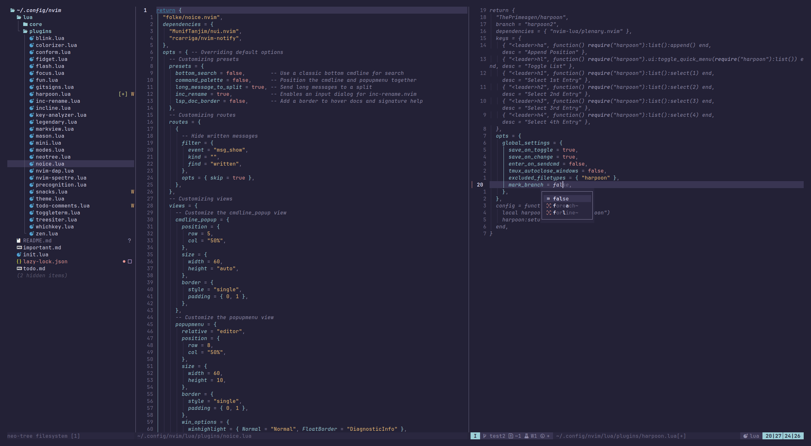

# Neovim Config
My Personal Neovim Config built from scratch using lazy.nvim as the plugin manager
 

## Features
Auto completion using blink.cmp, fuzzy searching using snacks.picker, and many more things

## Install

```bash
rm -rf ~/.config/nvim/ ~/.local/state/nvim/ ~/.local/share/nvim/ ~/.cache/nvim/
```

afterwards run:

```bash
git clone -b <BRANCH> https://github.com/Ssnibles/kickstart.nvim.git ~/.config/nvim
```

## Branches
- master - pretty much dead though I do push updates to it from time to time
- main - even more dead then master
- test - also dead lol
- test2 - most active and "main" branch at this point
